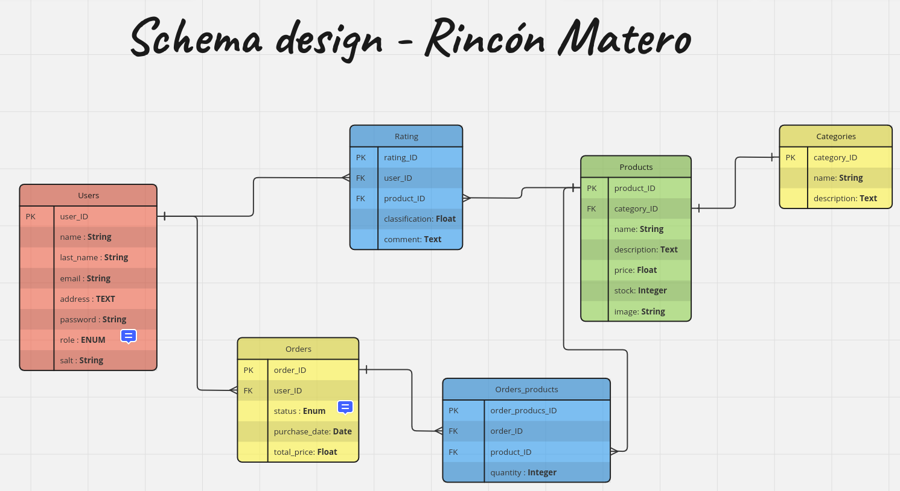

# Backend Rincon Matero
---

This is the back-end of rincon matero system. [Rincon Matero Front-end](https://github.com/nahuelRo/rincon-matero-front) connects here.

### Technologies
The project is developed in:
   
* [node.js](https://nodejs.org/es) 
* [express.js](https://expressjs.com/es/) 
* [postgreSQL.js](https://www.postgresql.org/) 
* [sequelize.js](https://sequelize.org/) 

### Required programs
---

In order to use the project on localhost it is necessary to clone it and have some necessary programs:

 * [node.js](https://nodejs.org/es) v18.17.1 lts or Higher.
 * Development IDE of your convenience Ej. [VS Code](https://code.visualstudio.com/)
 * PostMan for APIS tests. (Optional)
 * GIT to manage versions.

### How to Clone
---

Command to clone:

```bash
cd existing_folder
git clone [REPOSITORY LINK]
```

### Install
---

Once the project is cloned, it is necessary to install all the dependencies with the command:

```bash
npm install
```

In addition to cloning it, you will need to create a database on your localhost with postgresql and seed the data

```bash
createdb rincon_matero  // create db
npm run seed            // seed data
```

Run en LocalHost:

```bash
npm start
```

### Upload changes
---

To upload the changes we use 4 branches, Both bugfixes and features are merged into the development branch.

* Main (Production branch)
* Develop (Development branch)
* feature/your_new_feature 
* bugfix/bug_fixed 


### Structure folders
---

- api
- ├── /models
- ├── /controllers
- ├── /config
- ├── /routes
- ├── /utils
- └── server.js

---

### Schema Design
---


